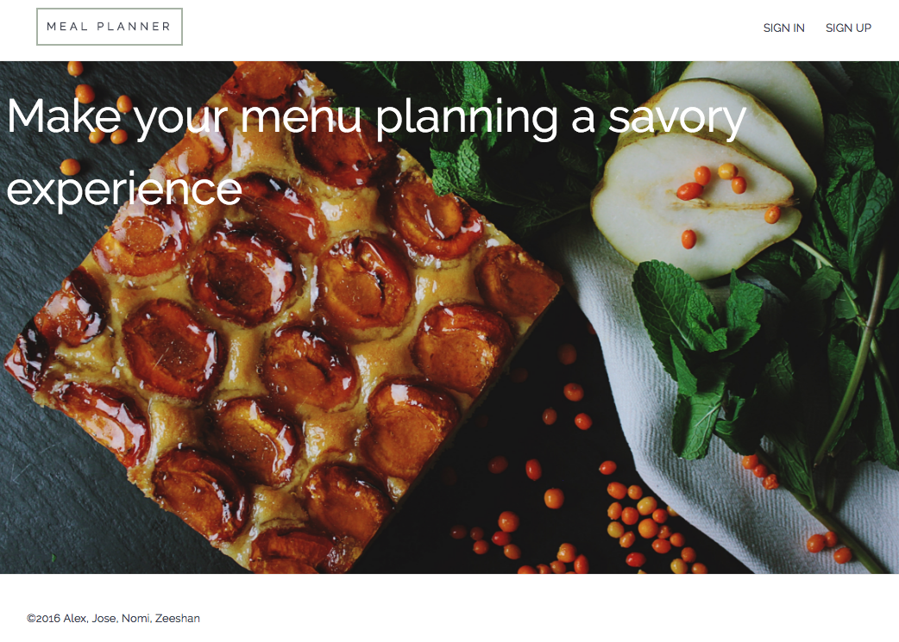
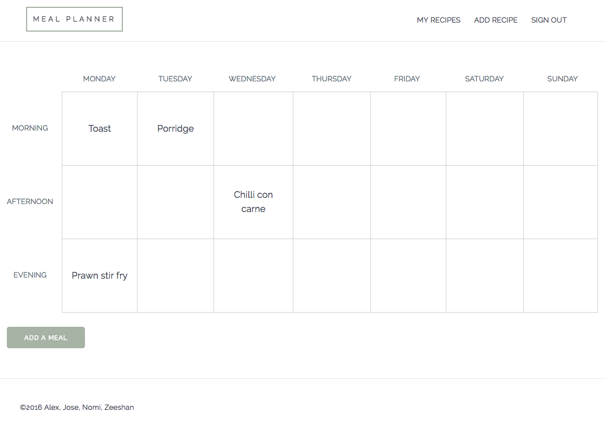

# Meal Planner

### Objectives of project

Extension of Makers Academy final group project. Originally envisioned as a simple recipe planning app I'm now extending the use case to target small food businesses that need to store recipes, cost up dishes, track inventory and generate shopping lists based on inventory stock.

### Technologies used

- Rails
- Javascript
- PostgreSQL
- Rspec
- Capybara
- SCSS (Milligram)
- HTML

### How to run the app

Clone repo to a local directory:

``git clone git@github.com:acsauk/meal_planner.git``

Create database structures and migrate database:

``rake db:create``
``rake db:migrate``

Run rails server:

``bin/rails s``

Navigate to:

``localhost:3000``

Alternatively the app is deployed to [Heroku](https://meal-planner-ma.herokuapp.com/)
